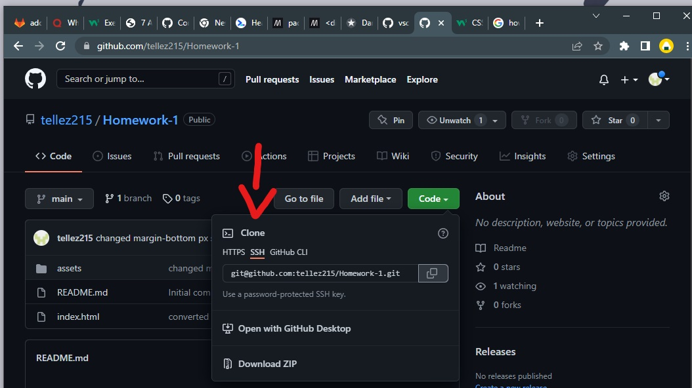

# INAKA

## Description
This is my project called INAKA. It was a project website with a couple errors and mistskes within the Index.html and CSS. 
It also wasn't fully accesible within the website so I made changes that make the website more accesible by adding 'alts' and new 'id' tags within the Index.html.

## Installation
1. Within [github](https://github.com/tellez215/INAKA), I made a new repository and copied the SSH key that it has made.
2. Then went to gitbash and cloned the SSH key from the the repository made.
3. Dragged content folder into the new repository folder.
4. Went into gitbash and procedded to do a 'git status' to confirm that the files were indeed there.
5. Then did a 'git add .' to add and confirm into our system.
6. Followed by a 'git commit -m' to add a messages with an update to push back.
7. With a 'git push origin main' it lets the progress and upates as well as the messages we had put, get pushed back to github.

## Usuage
#
#

## Credits
- Readme guide (https://www.makeareadme.com/)
- div to HTML tags guide (https://www.freecodecamp.org/news/semantic-html-alternatives-to-using-divs/)
- CSS guide (https://www.w3schools.com/w3css/defaulT.asp)

## License
[LICENSE](./LICENSE.md)

## Badges
